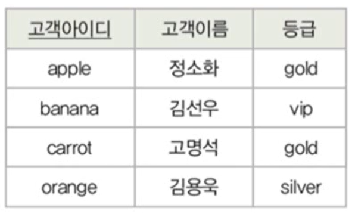

# 6장. 정규화

- **정규화의 개념과 이상 현상** -> 정규화의 필요성과 이상 현상의 의미 이해

- **함수 종속** -> 정규화를 수행하기 위해 함수 종속성의 개념 이해

- **기본 정규형과 정규화 과정** -> 정규형의 유형과 관계, 과정을 이해

> 정규화는 이상 현상을 제거하기 위해 이루어지는 과정

## 정규화의 개념과 이상현상

### 이상현상

**불필요한 데이터 중복**으로 인해 Relation에 대한 데이터 <u>삽입, 수정, 삭제</u> 연산을 수행할 때 발생할 수 있는 부작용

- `이상현상의 종류`

  1. **삽입 이상** : 새 데이터를 삽입할 때 <u>불필요한 데이터도 함께 삽입</u>해야 하는 문제

     ex) 아래 표에서, 이벤트에 참여하지 않아 이벤트번호, 당첨여부 정보가 없으면 새로운 데이터를 삽입할 수 없는 문제

     

  2. **갱신 이상** : 중복 튜플 중 <u>일부만 변경하여 데이터가 불일치</u> 하게 되는 모순의 문제

     ex) 아래 표에서, apple 아이디의 등급이 gold에서 vip로 승급했을 때 3개의 데이터를 전부 변경하지 않아 일부는 gold로 남는 문제

     

  3. **삭제 이상** : 튜블을 삭제하면 <u>꼭 필요한 데이터까지 함께 삭제</u>되는 손실의 문제

     ex) 아래 표에서, orange 아이디가 이벤트 참여를 취소했을 때, 이벤트 참여 여부만 삭제되는 것이 아니라 아이디, 이름, 등급까지 삭제되는 문제

     

### 정규화

**이상 현상을 제거**하면서 데이터베이스를 올바르게 설계하는 과정

=> **Relation을 <u>관련 있는 속성</u>들로만 구성** => 이를 위해 **Relation을 분해** (`함수적 종속성`을 판단하여 수행)

- `함수적 종속성` (FD: Functional Dependecy)
  - 속성들 간의 관련성
  - 함수 종속성을 이용하여, Relation을 연관서 있는 속성들로만 구성되도록 분해 (이렇게 해서 문제 없는 Relation을 만드는 것이 정규화)

## 함수 종속

- "X가 Y를 함수적으로 결정한다" == "Y가 X에 종속되어 있다" 
  - Relation 내의 모든 튜플을 대상으로, <u>하나의 X 값에 대한 Y값은 항상 하나</u>
  - X와 Y는 하나의 Realtion을 구성하는 속성들의 부분 집합
  - 표현 방법, `X→Y`
    - X: 결정자
    - Y: 종속자

위의 표에서,

`고객 아이디 → 고객 이름`, `고객 아이디 → 등급` **|** `고객 아이디 → (고객이름, 등급)`

- <u>각 고객 아이디 속성 값에 대응되는 고객 이름, 등급 속성이 단 하나</u>

### 함수 종속 관계 판단 시 유의 사항

- <u>속성 자체의 특성과 의미</u>를 기반으로 종속성을 판단
  - 속성 값은 계속 변할 수 있으므로, 현재 속성 값만으로 판단 X
    - ex) 위의 표에서, 현재는 고객 이름이 유일성을 가지고 있지만, 나중에 '정소화'라는 동명이인의 고객이 추가되면 유일성이 깨져버림
- 일반적으로 <u>기본키와 후보키</u>는 Relation의 다른 모든 속성들을 함수적으로 결정 (**결정자**)
- 기본키나 후보키가 아니어도 <u>다른 속성 값을 유일하게 결정하는 속성</u>은 **결정자**가 될 수 있음

### 예시

---

고객아이디 → 고객이름

{고객아이디, 이벤트번호} → 당첨여부

{고객아이디, 이벤트번호} → 고객이름

---

### 완전 함수 종속 vs 부분 함수 종속

- `완전 함수 종속` (FFD: Full Functional Dependency)
  - 일반적으로 함수 종속은 완전 함수 종속을 의미
  - 집합 Y가 집합 X의 일부분에는 종속되지 않음
  - ex) 당첨여부는 {고객아이디, 이벤트번호}에 완전 함수 종속

- `부분 함수 종속` (PFD: Partial Functional Dependency)

  - 집합 Y가 집합 X의 일부분에도 종속됨
  - eX) 고객이름은 {고객아이디, 이벤트번호}에 부분 함수 종속 (고객 아이디만으로도 고객 이름을 찾을 수 있음)

  

### 이행적 함수 종속

- `이행적 함수 종속` (transitive FD)
  - 세 개의 속성 집합 X, Y, Z에 대해, `X→Y`, `Y→Z`면 **`X→Z`**가 되는 것을 **Z가 X에 이행적 함수 종속**되었다고 한다

### 고려할 필요가 없는 함수 종속 관계

- <u>결정자와 종속자가 같거나</u>, <u>결정자가 종속자를 포함</u>하는 것처럼 당연한 함수 종속 관계는 고려 X
  - ex) 고객아이디 → 고객아이디 **|** {고객아이디, 이벤트번호} → 이벤트번호
